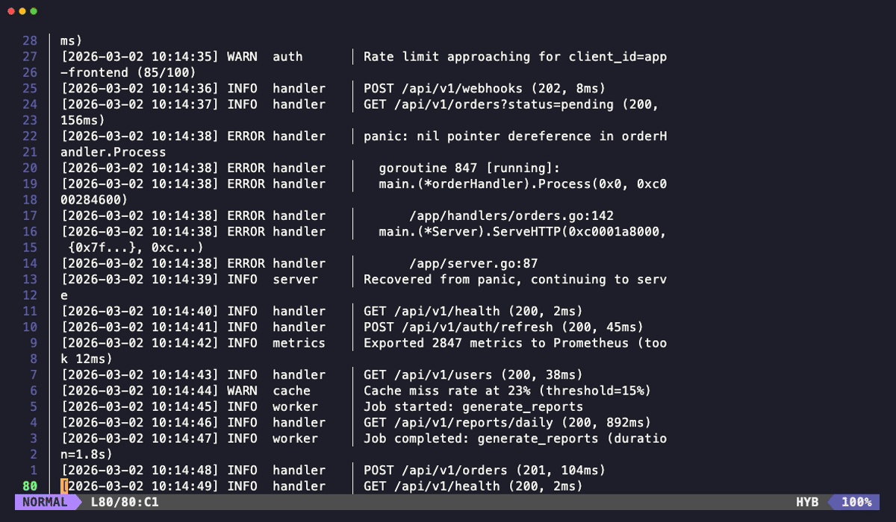
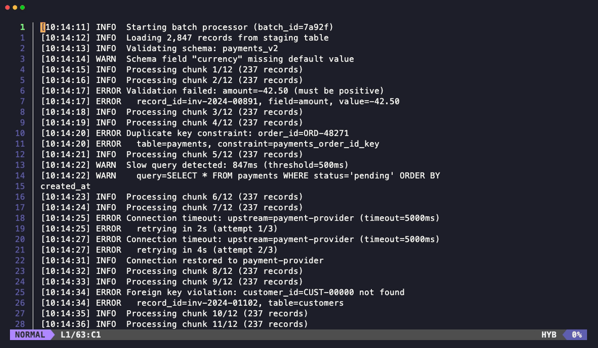
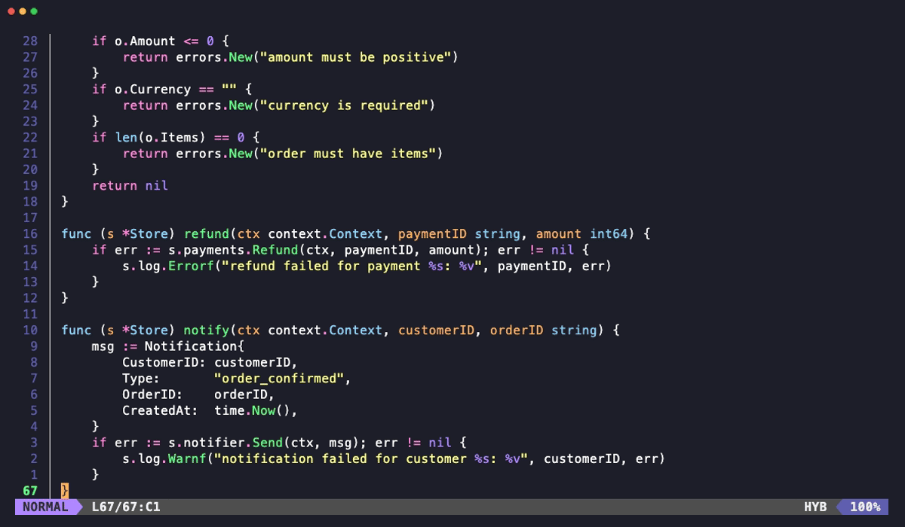
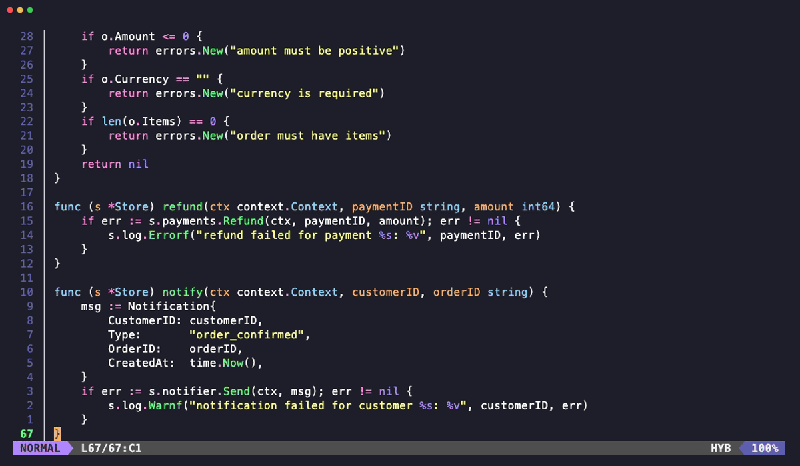
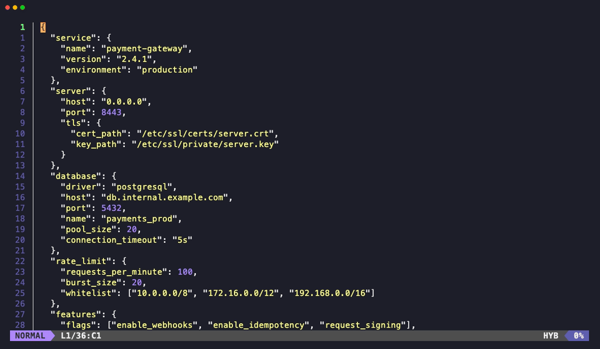
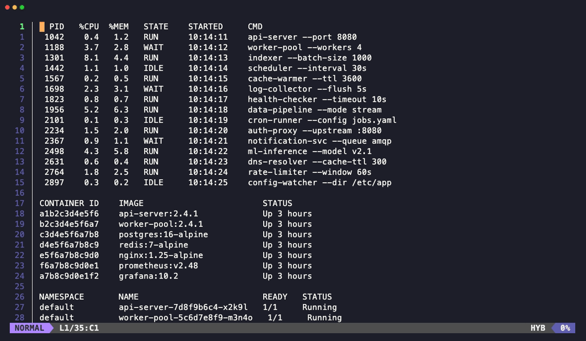
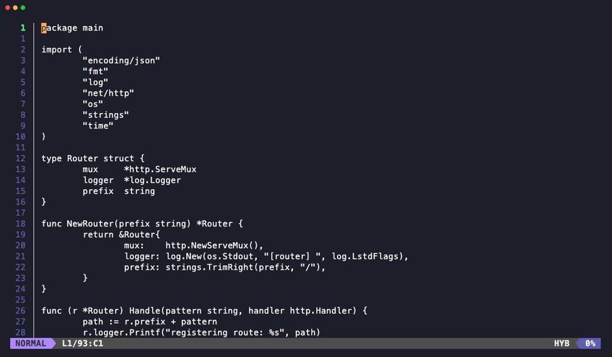
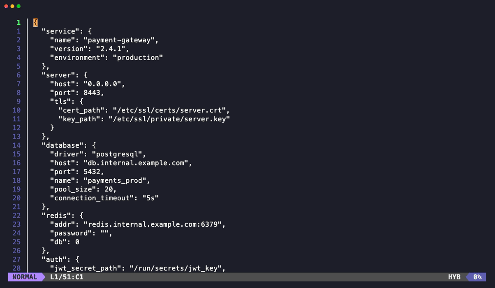
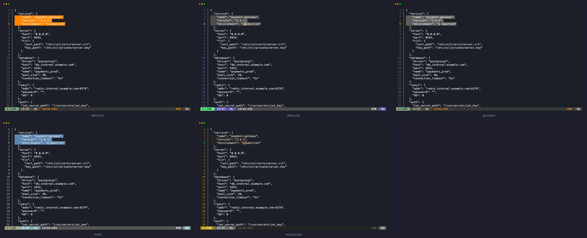

# tmux-yankee

Vim inside tmux. Kind of.

It started as "I just want line numbers in tmux yank mode" and spiraled into rebuilding half of Vim/Neovim and flash.nvim as a tmux plugin. No regrets. YOLO!



tmux-yankee captures your pane content into a Go TUI with line numbers, vim motions, visual selection, incremental search, flash navigation, text objects, and block select. You navigate with the same muscle memory as Vim, yank what you need, and it goes straight to your clipboard. The line number gutter is automatically stripped from yanked text.

## Quick Start

1. Press `prefix + N` to launch yankee
2. Navigate with vim motions (`j`/`k`, `w`/`b`, `gg`/`G`, `/pattern`)
3. Press `v` for visual select, `V` for line select, `Ctrl-v` for block select
4. Press `y` to yank and exit
5. Press `q` to quit without yanking

## Installation

### With [TPM](https://github.com/tmux-plugins/tpm)

Add to `~/.tmux.conf`:

```tmux
set -g @plugin 'shitcoding/tmux_yankee'
```

Press `prefix + I` to install. The Go binary is downloaded automatically from the latest GitHub release -- no build tools needed.

### Manual

```bash
git clone https://github.com/shitcoding/tmux_yankee ~/.tmux/plugins/tmux_yankee
```

Add to `~/.tmux.conf`:

```tmux
run-shell ~/.tmux/plugins/tmux_yankee/yankee.tmux
```

The binary will be downloaded on first run. To build from source instead:

```bash
cd ~/.tmux/plugins/tmux_yankee && make build
```

## Requirements

- tmux 3.1+
- Bash 4+
- `curl` (for automatic binary download)
- Go 1.24+ (only if building from source)

## How It Actually Works

tmux doesn't let you draw arbitrary UI on top of a running pane. So yankee uses a trick borrowed from [tmux-fingers](https://github.com/Morantron/tmux-fingers): it creates a **temporary helper session**, runs the TUI there, and `swap-pane` puts it where your original pane was. When you quit, it swaps back. Your shell process, history, environment variables, working directory -- everything is exactly where you left it.

## Features

### Search and Navigation

Incremental regex search with match highlighting. `n`/`N` to cycle matches, `*`/`#` to search the word under cursor. All the vim motion keys you'd expect: `w`/`b`/`e`, `gg`/`G`, `{`/`}`, `H`/`M`/`L`, `Ctrl-u`/`Ctrl-d`, and count prefixes (`5j`, `10G`, `3w`).



### Flash Jump

Inspired by [flash.nvim](https://github.com/folke/flash.nvim). Press `s`, type a pattern, and labeled jump targets appear on every match. Press the lowercase label to jump to end of match, or the uppercase (Shift) label to jump to start of match. Both positions are configurable.



### Flash + Visual Select

Enter visual mode with `v`, then use flash (`s`) to extend your selection to a distant target. Chain multiple flash jumps to select exactly the range you need without scrolling.



### Text Objects

Vim text objects for selecting inside/around quotes, brackets, braces, parentheses, words, and paragraphs. `vi"` to select inside double quotes, `va{` to select around curly braces, `iw` for inner word, etc.



### Block Select

Visual block mode (`Ctrl-v`) for column selection. Select rectangular regions across multiple lines -- useful for grabbing a specific column from tabular output like `ps aux`.



### Line Number Modes

Three modes just like Vim: absolute (`set number`), relative (`set relativenumber`), and hybrid (`set number relativenumber`). Toggle with `Alt+Shift+L`.



### Themes

Five built-in themes. Cycle through them at runtime with `Alt+t`.





### Mouse Support

When `set -g mouse on` is set in tmux:

| Action | What happens |
|--------|-------------|
| Scroll up in shell | Launches yankee (replaces tmux copy-mode) |
| Left-click in yankee | Set cursor position |
| Left-click drag | Character-wise selection |
| Scroll in yankee | Navigate up/down |

Mouse-aware apps (vim, less, etc.) and alternate-screen programs are detected and left alone.

> **Note:** The `WheelUpPane` override only activates when `@yankee_mouse` is set to `on`. With the default `off`, scroll-up uses tmux's native copy-mode entry.

## Keybindings

### Motions

All motions support count prefixes (`5j`, `3w`, `10G`).

| Key | Action |
|-----|--------|
| `h`/`j`/`k`/`l` | Left / Down / Up / Right |
| `Left`/`Down`/`Up`/`Right` | Same as `h`/`j`/`k`/`l` |
| `w`/`b`/`e` | Word forward / backward / end |
| `ge` / `gE` | Word / WORD end backward |
| `W`/`B`/`E` | WORD forward / backward / end |
| `0` / `$` | Line start / end |
| `Home` / `End` | Line start / end |
| `^` / `g_` | First / last non-blank character |
| `gg` / `G` | First / last line (or `{count}G` for goto line) |
| `{` / `}` | Paragraph backward / forward |
| `H` / `M` / `L` | Screen top / middle / bottom |
| `%` | Matching bracket (or `{count}%` for percentage) |
| `Ctrl-u` / `Ctrl-d` | Half page up / down |
| `Ctrl-f` / `Ctrl-b` | Full page up / down |
| `PgUp` / `PgDn` | Page up / down |
| `Ctrl-y` / `Ctrl-e` | Scroll viewport one line up / down |
| `zt` / `zz` / `zb` | Position cursor line at top / center / bottom |
| `gj` / `gk` | Display line down / up (when wrap mode is on) |

### Search

| Key | Action |
|-----|--------|
| `/` | Forward search |
| `?` | Backward search |
| `n` / `N` | Next / previous match |
| `*` / `#` | Search word under cursor forward / backward |
| `gn` / `gN` | Select next / previous match |
| `\` | Clear search highlights |

### Character Search

| Key | Action |
|-----|--------|
| `f{char}` / `F{char}` | Find char forward / backward |
| `t{char}` / `T{char}` | Till char forward / backward |
| `;` / `,` | Repeat / reverse last char search |

### Flash Navigation

| Key | Action |
|-----|--------|
| `s` | Enter flash mode -- type a pattern, and labeled jump targets appear |
| lowercase label (e.g. `a`) | Jump to target at primary position (default: end of match) |
| uppercase label (e.g. `A`) | Jump to target at alternate position (default: start of match) |
| `Esc` | Exit flash mode |

Every match on screen gets a label. Press the **lowercase** label key to jump to the primary position, or the **uppercase** (Shift) version of the same label to jump to the alternate position. This lets you land on either side of a match without reconfiguring.

Up to 26 matches get labels (the label pool is `a-z`); additional matches are highlighted but unlabeled.

Primary and alternate jump positions are configurable via `@yankee_flash_jump_pos` and `@yankee_flash_alt_jump_pos`:

| Value | Lands on |
|-------|----------|
| `match_end` | Last character of the match (default for lowercase) |
| `match_start` | First character of the match (default for uppercase) |
| `word_start` | Start of the word containing the match |
| `word_end` | End of the word containing the match |
| `off` | Disable alternate jump (uppercase labels ignored) |

Search is smartcase: all-lowercase patterns match case-insensitively, patterns with any uppercase character match exactly.

Works in both normal and visual mode. In visual mode, flash extends the selection to the jump target.

### Command Line

| Key | Action |
|-----|--------|
| `:` | Enter command mode |
| `:42` + `Enter` | Jump to line 42 |

### Visual Mode and Yanking

| Key | Action |
|-----|--------|
| `v` | Character-wise visual mode |
| `V` | Line-wise visual mode |
| `Ctrl-v` | Block-wise (column) visual mode |
| `o` / `O` | Swap cursor to other end / corner |
| `y` / `Enter` | Yank selection |
| `yy` | Yank current line (normal mode) |

### Text Objects (in visual mode)

| Key | Selects |
|-----|---------|
| `iw` / `aw` | Inner / around word |
| `iW` / `aW` | Inner / around WORD |
| `ip` / `ap` | Inner / around paragraph |
| `i"` / `a"` | Inside / around double quotes |
| `i'` / `a'` | Inside / around single quotes |
| `` i` `` / `` a` `` | Inside / around backticks |
| `ib` / `ab` or `i(` / `a(` or `i)` / `a)` | Inside / around parentheses |
| `iB` / `aB` or `i{` / `a{` or `i}` / `a}` | Inside / around braces |
| `i[` / `a[` or `i]` / `a]` | Inside / around square brackets |
| `i<` / `a<` or `i>` / `a>` | Inside / around angle brackets |

### Marks

| Key | Action |
|-----|--------|
| `m{a-z}` | Set mark |
| `` `{a-z} `` | Jump to mark (exact position) |
| `'{a-z}` | Jump to mark line |
| `` `` `` / `''` | Jump to previous position (before last jump) |

### Other

| Key | Action |
|-----|--------|
| `Alt+Shift+L` | Cycle line number modes |
| `Alt+t` | Cycle themes |
| `gw` | Toggle word wrap |
| `Ctrl-o` / `Ctrl-i` | Jump list backward / forward |
| `Esc` | Exit visual mode; in normal mode: clear search highlights |
| `q` / `Ctrl-c` | Quit |

## Configuration

All options go in `~/.tmux.conf` before the plugin is loaded. They use the `@yankee_` prefix.

### Launch

| Option | Default | Values | Description |
|--------|---------|--------|-------------|
| `@yankee_key` | `N` | single key | Key to trigger yankee (with prefix) |
| `@yankee_key_table` | `prefix` | `prefix`, `root` | Key table for the trigger key |
| `@yankee_start_position` | `bottom` | `top`, `middle`, `bottom` | Initial cursor position |

### Line Numbers

| Option | Default | Values | Description |
|--------|---------|--------|-------------|
| `@yankee_mode` | `hybrid` | `absolute`, `relative`, `hybrid` | Line number display mode |
| `@yankee_scrollback_lines` | `2000` | `100`..`200000` | Lines of scrollback to capture |
| `@yankee_toggle_mode_key` | `L` | single key | Key to cycle line number modes at runtime |

### Behavior

| Option | Default | Values | Description |
|--------|---------|--------|-------------|
| `@yankee_copy_target` | `both` | `both`, `tmux`, `clipboard` | Where yanked text goes |
| `@yankee_exit_on_yank` | `on` | `on`, `off` | Close after yanking |
| `@yankee_wrap_mode` | `off` | `on`, `off` | Word wrap for long lines |
| `@yankee_wrap_key` | `w` | single key | Key to toggle wrap (after `g` prefix) |
| `@yankee_mouse` | `off` | `on`, `off` | Mouse support in TUI (click, drag, scroll) |
| `@yankee_status_bar` | `on` | `on`, `off` | Show the powerline status bar |

### Flash

| Option | Default | Values | Description |
|--------|---------|--------|-------------|
| `@yankee_flash` | `on` | `on`, `off` | Enable flash navigation |
| `@yankee_flash_min_chars` | `1` | number | Min pattern length before labels appear |
| `@yankee_flash_ft` | `off` | `on`, `off` | Use flash labels for `f`/`t`/`F`/`T` motions |
| `@yankee_flash_jump_pos` | `match_end` | `match_start`, `match_end`, `word_start`, `word_end` | Where lowercase label lands |
| `@yankee_flash_alt_jump_pos` | `match_start` | same as above, plus `off` | Where uppercase label lands |

**`@yankee_flash_min_chars`** — Controls how many characters you must type before labels appear. Default `1` shows labels after a single character. Set to `2` or `3` to reduce visual noise when searching in dense content.

**`@yankee_flash_ft`** — When `on`, the `f`/`t`/`F`/`T` character search motions also show flash labels when there are multiple matches on the same line. Useful when a character appears many times on a long line.

**`@yankee_flash_jump_pos` / `@yankee_flash_alt_jump_pos`** — Control where the cursor lands when pressing a label. Lowercase label uses `jump_pos`, uppercase (Shift) label uses `alt_jump_pos`. The four positions are:

- `match_end` — last character of the matched text (default for lowercase)
- `match_start` — first character of the matched text (default for uppercase)
- `word_start` — beginning of the word containing the match
- `word_end` — end of the word containing the match

Set `@yankee_flash_alt_jump_pos "off"` to disable uppercase label jumps entirely.

**Flash colors** are configured in the Theme section below (`@yankee_flash_label_fg`, `@yankee_flash_match_fg`, `@yankee_flash_backdrop`).

Example:

```tmux
# Require 2 chars before showing labels
set -g @yankee_flash_min_chars 2

# Lowercase label jumps to start of match, uppercase to end
set -g @yankee_flash_jump_pos "match_start"
set -g @yankee_flash_alt_jump_pos "match_end"

# Enable flash labels for f/t motions
set -g @yankee_flash_ft "on"
```

### Theme

| Option | Default | Values | Description |
|--------|---------|--------|-------------|
| `@yankee_theme` | `default` | `default`, `dracula`, `gruvbox`, `nord`, `solarized` | Color theme |

Individual color overrides (`#RRGGBB` format) can be layered on top of any theme:

| Option | Element |
|--------|---------|
| `@yankee_cursor_fg` / `_bg` | Cursor line |
| `@yankee_selection_fg` / `_bg` | Visual selection |
| `@yankee_gutter_fg` / `_bg` | Gutter background |
| `@yankee_gutter_separator_fg` | Separator between gutter and content |
| `@yankee_linenum_absolute_fg` | Absolute line numbers |
| `@yankee_linenum_relative_fg` | Relative line numbers |
| `@yankee_linenum_cursor_fg` | Cursor line number |
| `@yankee_status_fg` / `_bg` | Status bar fill area |
| `@yankee_flash_label_fg` / `_bg` | Flash labels |
| `@yankee_flash_match_fg` / `_bg` | Flash matches |
| `@yankee_flash_backdrop` | Flash dimmed background |

### Style Overrides

These use `on`/`off` values and layer on top of any theme:

| Option | Element |
|--------|---------|
| `@yankee_linenum_absolute_bold` / `_dim` / `_italic` | Absolute line numbers |
| `@yankee_linenum_relative_bold` / `_dim` / `_italic` | Relative line numbers |
| `@yankee_linenum_cursor_bold` / `_dim` / `_italic` | Cursor line number |
| `@yankee_status_bold` / `_dim` | Status bar fill area |
| `@yankee_cursor_dim` / `_italic` | Cursor line |
| `@yankee_selection_dim` / `_italic` | Visual selection |
| `@yankee_gutter_separator_bg` | Gutter separator background (`#RRGGBB`) |
| `@yankee_gutter_separator_char` | Gutter separator character |

### Custom Keybindings

Rebind, unbind, or add mode-specific bindings:

```tmux
# Remap Ctrl-d to a different action
set -g @yankee_bind_C-d half_page_down

# Remove a default binding
set -g @yankee_unbind_H ""

# Normal-mode only binding
set -g @yankee_nbind_x some_action

# Visual-mode only binding
set -g @yankee_vbind_x some_action
```

Key notation: single chars (`h`, `j`), Ctrl (`C-d`, `C-f`), Alt (`M-t`), special (`Enter`, `Esc`, `Space`).

Mode-specific unbinding uses `@yankee_nunbind_*` (normal mode) and `@yankee_vunbind_*` (visual mode).

<details>
<summary>All action names</summary>

```
move_up, move_down, move_left, move_right, line_start, line_end,
first_nonblank, last_nonblank, first_line, last_line, word_forward,
word_backward, word_end, word_end_backward, WORD_forward, WORD_backward,
WORD_end, WORD_end_backward, paragraph_forward, paragraph_backward,
half_page_up, half_page_down, page_up, page_down, screen_top,
screen_middle, screen_bottom, scroll_line_up, scroll_line_down,
match_bracket, viewport_top, viewport_center, viewport_bottom,
display_line_down, display_line_up, jump_back, jumplist_back,
jumplist_forward, set_mark, goto_mark, goto_mark_line, visual_char,
visual_line, visual_block, swap_end, swap_corner, yank, yank_line,
search_forward, search_backward, search_next, search_prev,
search_word_forward, search_word_backward, search_select,
search_select_back, char_search_f, char_search_t, char_search_F,
char_search_T, char_search_repeat, char_search_reverse,
inner_word, a_word, inner_WORD, a_WORD, inner_paragraph, a_paragraph,
inner_quote, a_quote, inner_single_quote, a_single_quote,
inner_backtick, a_backtick, inner_paren, a_paren, inner_brace,
a_brace, inner_bracket, a_bracket, inner_angle, a_angle,
clear_search, colon_mode, toggle_line_mode, toggle_wrap_mode,
escape, quit, flash, theme_next, theme_prev
```

</details>

### Example Config

```tmux
# Dracula theme, generous scrollback
set -g @yankee_theme "dracula"
set -g @yankee_scrollback_lines 5000

# Don't close after yank -- browse and yank multiple times
set -g @yankee_exit_on_yank "off"

# Start at top of content
set -g @yankee_start_position "top"

# Flash with 2-char minimum before labels
set -g @yankee_flash_min_chars 2

# Copy to clipboard only (skip tmux buffer)
set -g @yankee_copy_target "clipboard"
```

## Clipboard Support

Yankee detects your system clipboard automatically:

| Platform | Backend |
|----------|---------|
| macOS | `pbcopy` |
| Linux (X11) | `xclip` or `xsel` |
| Linux (Wayland) | `wl-copy` |
| WSL | `clip.exe` |
| Cygwin | `putclip` |

By default, yanked text goes to both the system clipboard and the tmux paste buffer. Change with `@yankee_copy_target`.

## Known Limitations

- **Snapshot view** -- content is captured at launch time. If your pane keeps producing output, you won't see it until you relaunch.
- **Older tmux versions** -- tmux 3.1-3.1c works but may show brief visual artifacts during overlay swap.
- **No true vim registers** -- there's one yank destination (clipboard + tmux buffer), not 26 named registers.
- **Flash label cap** -- labels are limited to 26 (`a-z`). In dense content with many matches, some matches appear highlighted but without jump labels.

## Troubleshooting / FAQ

**Binary not found** -- Run `make build` from the plugin directory, or reinstall via TPM (`prefix + I`).

**Nothing happens on `prefix+N`** -- Check that `@yankee_key` is set correctly. Reload the plugin manually:
```bash
bash ~/.tmux/plugins/tmux_yankee/yankee.tmux
```

**Clipboard not working** -- Verify your platform's clipboard tool is installed: `pbcopy` (macOS), `xclip` or `xsel` (X11), `wl-copy` (Wayland).

**Mouse scroll launches yankee but I want native copy-mode** -- Set `@yankee_mouse` to `off` (the default). If you previously set it to `on`, add `set -g @yankee_mouse off` and reload the plugin.

**Supported platforms** -- macOS (amd64/arm64), Linux (amd64/arm64).

## License

MIT
